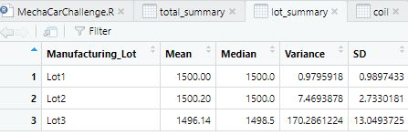
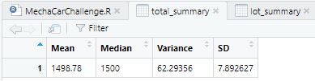
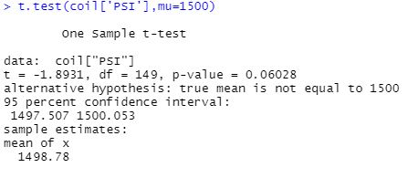
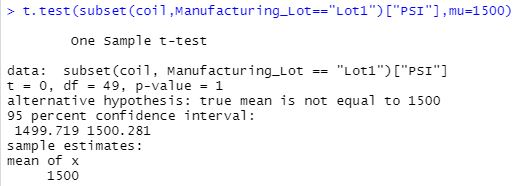
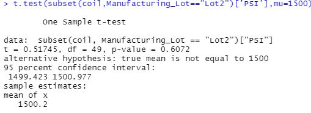
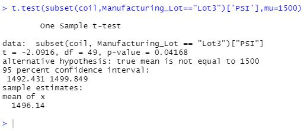

# MechaCar_Statistical_Analysis

## Summary Statistics on Suspension Coils

Per the design specification that the variance of the suspension coils must not exceed 100 pounds, the current manufacturing data does not meet the deisgn specification for all lots.  Specifically, lot 3 should be rejected for failing to meet the 100-PSI design requirement as can be seen in the lot summary below:

Furthermore, given that lot 3 failed to meet the design spec, using the total summary statistics is likely not best practice for examining overall performance since the failing values are hidden as can be seen in the total summary below:

## T-Tests on Suspension Coils

It can be seen from observing a one sample t-test of the summary statistics that the sample mean from coils.csv is not statistically significantly different from the population mean since the t-test failed to reject the null hypothesis for an alpha value of 0.05 by yielding a p-value of 0.06.

For lots 1 and 2, they both show as not being statistically significantly different from the population mean by yielding p-values above an alpha value of 0.05.  The p-value for Lot1 is 1 and the p-value for Lot2 is 0.6 as shown below:

For Lot 3, the mean demonstrates iteslf as being statistically significantly different by yielding a p-value less than an alpha value of 0.05 with a p-value of 0.04 as shown below:

## MechaCar vs Competition

### Metric

With ever-rising gas prices, a priority for drivers is how many miles per gallon their car gets.

### Null Hypothesis

The null hypothesis for us to test is that the miles per gallon for MechaCar is at least 5 mpg higher its leading competitor car in the same class.  H0: MPGMechaCar > MPGCompetitor + 5

### Statistical Test

The analysis will be performed using a 2-sample T-Test to compare the mpg of MechaCar to comptetitor cars.

### Data

To perform this test, several MechaCar prototypes and several of the leading competitor car will have to be driven through equivalent test profiles to build an average MPG datum for each vehicle.  Once each vehicle has an average MPG calculated, those points may be built into a DataFrame in R to be analyzed using a 2-sample T-Test to determine if the data support rejecting or failing to reject our null hypothesis.